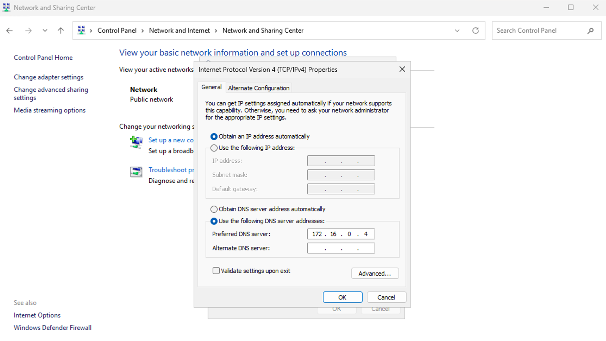

# 01 - Environment Setup

## Objective
Build a functional Active Directory lab environment in Microsoft Azure 
consisting of a Windows Server 2022 Domain Controller and a Windows 11 Pro 
client VM joined to the domain. This forms the foundation for all 
subsequent lab sections.

## Environment
- Microsoft Azure (Cloud Platform)
- Windows Server 2022 (Domain Controller)
- Windows 11 Pro (Client VM)
- Active Directory Domain Services (AD DS)
- PowerShell

## Network Overview
Both VMs are deployed in the same Azure Virtual Network (VNet) so they 
can communicate with each other. The domain controller holds a static 
private IP address which the client uses as its DNS server — this is 
essential for domain join to work correctly.

| Machine | Role | OS |
|---|---|---|
| DC-01 | Domain Controller | Windows Server 2022 | 172.16.0.4 |
| GG-Client01 | Domain Client | Windows 11 Pro | 172.16.0.5 |

---

## Part 1 — Domain Controller Setup

### Step 1 - Create Windows Server VM in Azure
Created a Windows Server 2022 VM in Azure. Assigned a static private IP 
address through the Azure portal on the network interface. A static IP 
is critical here because the client VM will point directly to this IP 
for DNS — if it changes the client loses the ability to find the domain.

### Step 2 - Install Active Directory Domain Services
Opened Server Manager → Add Roles and Features → selected Active 
Directory Domain Services → installed.

### Step 3 - Promote Server to Domain Controller
After installation clicked the notification flag in Server Manager → 
Promote this server to a domain controller → Add a new forest → set 
root domain name to **lab.local** → completed promotion → server 
restarted automatically.

After restart logged back in as:
```
lab\Administrator
```

### Step 4 - Verify DNS
Opened Server Manager → Tools → DNS → confirmed lab.local appeared 
under Forward Lookup Zones with SOA and NS records present.

Active Directory is heavily dependent on DNS. Verifying this early 
prevents harder to diagnose problems later.


---

## Part 2 — Client VM Setup

### Step 5 - Create Windows 11 Pro Client VM in Azure
Created a Windows 10 VM in the same resource group and same Virtual 
Network as the domain controller. Placing both VMs on the same VNet 
is essential — without this they cannot communicate.

### Step 6 - Point Client DNS to Domain Controller

Inside the client VM opened Windows network adapter settings:

Right clicked Start → Network Connections → Change Adapter Options → 
right clicked the network adapter → Properties → Internet Protocol 
Version 4 (TCP/IPv4) → Properties → selected "Use the following DNS 
server addresses" → entered the domain controller's private IP as the 
Preferred DNS server:
```
Preferred DNS Server: 172.16.0.4
```

Clicked OK to save.

This tells the client where to find the domain controller. Without this 
step the client cannot resolve lab.local and the domain join will fail.

**Troubleshooting note:** Attempted to set the DNS server through the 
Azure portal on the Network Interface settings but received errors and 
the option was not saving correctly. Resolved by setting the DNS server 
manually inside the Windows network adapter settings within the client 
VM itself. The client needs to point to the domain controller's private 
IP for DNS regardless of where that setting is configured.



### Step 7 - Verify DNS on Client
After restart opened Command Prompt on the client and ran:
```cmd
ipconfig /all
```
Confirmed the DNS server line showed the domain controller's private IP.


---

## Part 3 — Domain Join

### Step 8 - Join Client to Domain
Opened PowerShell as Administrator on the client and ran:
```powershell
Add-Computer -DomainName "lab.local" -Credential (Get-Credential) -Restart
```
Entered domain administrator credentials when prompted. Client restarted 
automatically after successful join.

### Step 9 - Verify Domain Join on Server
Back on the domain controller opened ADUC → confirmed client machine 
appeared in the Computers container.
```powershell
Get-ADComputer -Filter * | Select Name
```


---

## Part 4 — Domain User Login

### Step 10 - Log Into Client as Domain User
Logged into the client VM as a domain user to confirm end to end 
authentication is working.
```
Username: lab\dzbornak
Password: Dorothy123!
```

Opened Command Prompt and ran the following to confirm domain 
authentication:
```cmd
whoami
```
```cmd
echo %logonserver%
```
```cmd
systeminfo | findstr /i "domain"
```


**Troubleshooting note:** Domain users do not have Remote Desktop 
access by default. Had to explicitly grant RDP permissions to the 
domain user before login was possible:
```powershell
Add-LocalGroupMember -Group "Remote Desktop Users" -Member "lab\dzbornak"
```
This is a common real world configuration step that is easy to overlook.

**Troubleshooting note:** On a Mac using the Windows App for RDP there 
is no built in way to send Ctrl+Alt+Delete for forced password changes. 
Worked around this by resetting the user password from the server and 
disabling the force password change flag:
```powershell
Set-ADAccountPassword -Identity dzbornak -Reset -NewPassword (ConvertTo-SecureString "Dorothy123!" -AsPlainText -Force)
Set-ADUser -Identity dzbornak -ChangePasswordAtLogon $false
```

**Troubleshooting note:** Initially created the client VM in a separate 
Virtual Network from the domain controller. The domain join failed 
repeatedly and the client could not resolve lab.local even with DNS 
pointed correctly at the domain controller's private IP.

After investigation the root cause was that Azure Virtual Networks are 
isolated from each other by default — VMs on different VNets cannot 
communicate without additional configuration such as VNet peering.

Resolved by deleting the client VM and recreating it in the same Virtual 
Network as the domain controller. Domain join succeeded immediately after 
this change.

Key lesson: In Azure, all machines that need to communicate must share 
the same Virtual Network, or VNet peering must be explicitly configured. 
This mirrors real world network segmentation concepts where machines on 
different subnets or networks require routing or firewall rules to reach 
each other.
---

## Summary
Successfully built a two machine Active Directory lab environment in 
Azure. The domain controller is running AD DS with DNS configured for 
lab.local. The Windows 11 client is joined to the domain and confirmed 
domain user authentication end to end. This environment is the 
foundation for all subsequent lab tasks including account management, 
group policy, and user lifecycle management.