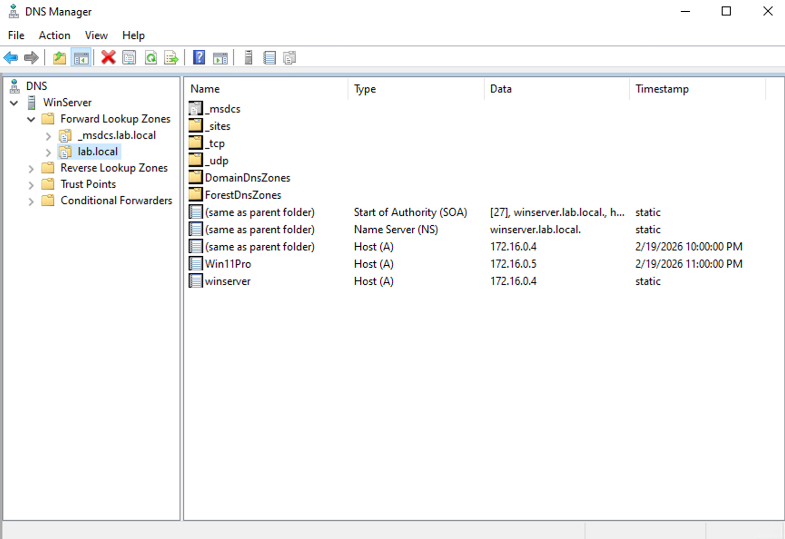
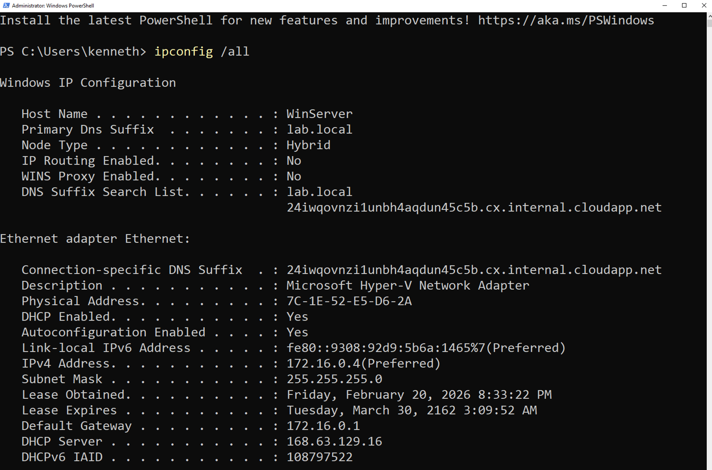
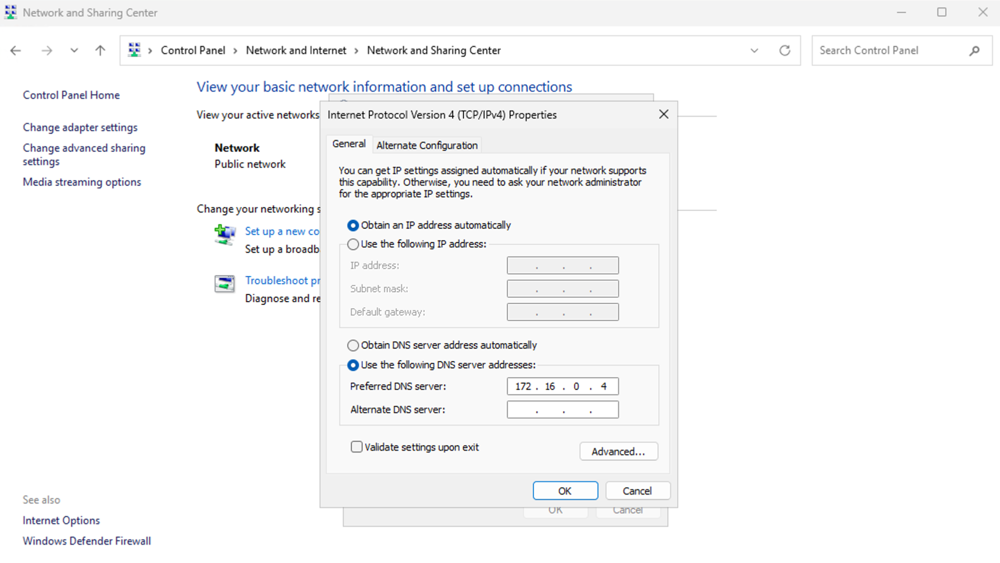
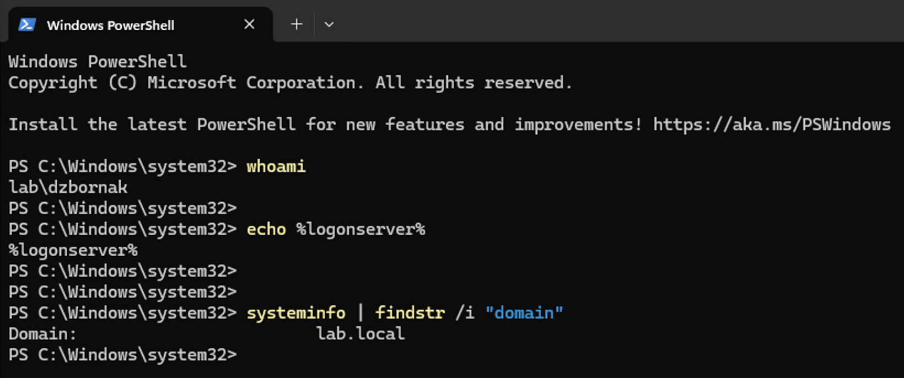
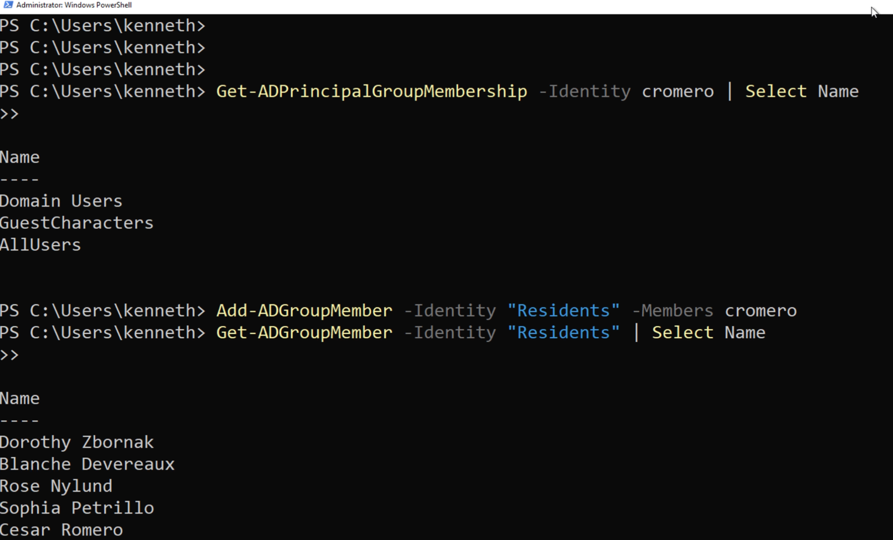
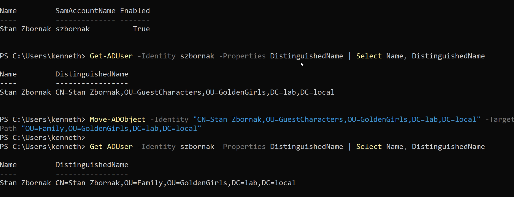
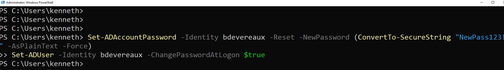
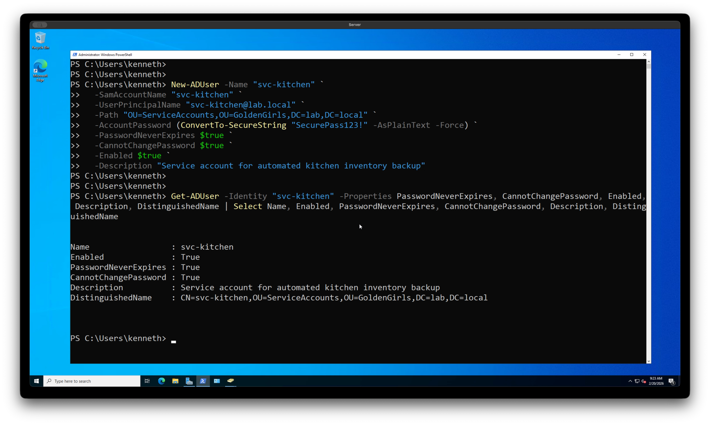
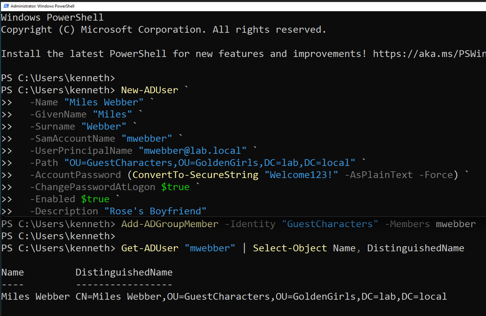

# Active Directory Home Lab

## Objective
Deploy and configure an Active Directory environment in Microsoft Azure to
simulate real-world enterprise identity management. Perform common help desk
and sysadmin tasks using PowerShell, demonstrating hands-on
proficiency with the tools and workflows used daily in IT support roles.

## Tools & Technologies Used
- Microsoft Azure (VM hosting and VNet configuration)
- Windows Server (Domain Controller)
- Windows 11 Pro (Domain Client)
- Active Directory Domain Services (AD DS)
- PowerShell
- Remote Desktop Protocol (RDP)

## Real-World Relevance
Active Directory is the backbone of identity management in the vast majority
of enterprise environments. Tier 1 help desk technicians interact with AD
daily — resetting passwords, unlocking accounts, managing group memberships,
and onboarding and offboarding users. This lab demonstrates hands-on
proficiency with these core responsibilities in a simulated enterprise
environment.

## Lab Theme
To make this lab more engaging and memorable, the environment was built around
the cast and characters of The Golden Girls. The domain `lab.local` represents
the household, with Organizational Units organized by each character's role and
relationship to the house. Real cast members were added as users with
descriptions noting their roles on the show.

## Repository Structure
```
active-directory-lab/
├── README.md
├── 01-environment-setup/
├── 02-ou-groups-users/
├── 03-account-management/
├── 04-service-accounts/
└── 05-onboarding-offboarding/
```

---

## Part 1 — Environment Setup

Deployed two virtual machines in Microsoft Azure on the same Virtual Network
(VNet) to simulate an enterprise domain environment:

- **WinServer** — Windows Server configured as the Active Directory Domain
  Controller for the domain `lab.local`
- **Win11Pro** — Windows 11 Pro client joined to the `lab.local` domain

### DNS Configuration

A critical step in joining a client to a domain is pointing the client's DNS
to the domain controller's private IP address. Without this the client cannot
locate the domain and the join will fail.

The domain controller's DNS was verified to confirm it was resolving correctly,
and the client's network adapter DNS was manually set to the domain controller's
private IP address via adapter settings and confirmed via ipconfig.





### Client Joined to Domain

After configuring DNS, the Windows 11 Pro client was joined to the `lab.local`
domain. The join was verified in two ways — the client computer appeared in
Active Directory Users and Computers under the Computers container, and a
successful domain login was performed on the client machine.




---

## Part 2 — OU Structure, Groups, and User Management

Created an Organizational Unit structure to mirror a real enterprise directory,
organized around the Golden Girls household. Managed group memberships and
moved user objects between OUs to simulate real-world access changes and
department transfers.

**OU Structure:**
- `GoldenGirls` — top level OU containing all sub-OUs
  - `Family` — main household members
  - `GuestCharacters` — recurring guest cast
  - `Residents` — residents of the household
  - `ServiceAccounts` — service and admin accounts
  - `DisabledAccounts` — offboarded or inactive users

### Add User to Group

**Scenario:** Cesar Romero's character Tony has become a regular presence in
the house and needs to be added to the Residents group to gain access to shared
household resources.

**GUI Method:**
ADUC → find Cesar Romero → right click → Add to a group → type Residents → OK

**PowerShell Method:**
```powershell
Add-ADGroupMember -Identity "Residents" -Members cromero

# Verify group membership
Get-ADGroupMember -Identity "Residents" | Select Name
```




---
### Move Object to Different OU

**Scenario:** Stan Zbornak started as a GuestCharacter but has been around so
much he needs to be moved to the Family OU — very on brand for Stan.

**GUI Method:**
ADUC → find Stan Zbornak → right click → Move → select Family OU → OK

**PowerShell Method:**
```powershell
Move-ADObject `
  -Identity "CN=Stan Zbornak,OU=GuestCharacters,OU=GoldenGirls,DC=lab,DC=local" `
  -TargetPath "OU=Family,OU=GoldenGirls,DC=lab,DC=local"
```


## Part 3 — Account Management

Performed the two most common Tier 1 Active Directory help desk tasks —
password resets and account unlocks — using both the GUI and PowerShell.

### Password Reset

**Scenario:** Blanche Devereaux called the help desk saying she cannot log in.
With too many admirers calling she lost track of her password.

**GUI Method:**
ADUC → find Blanche Devereaux → right click → Reset Password → set temporary
password → check "User must change password at next logon"

**PowerShell Method:**
```powershell
Set-ADAccountPassword -Identity bdevereaux `
  -Reset `
  -NewPassword (ConvertTo-SecureString "NewPass123!" -AsPlainText -Force)

Set-ADUser -Identity bdevereaux -ChangePasswordAtLogon $true
```


---

### Account Unlock

**Scenario:** Dorothy Zbornak tried logging in too many times with the wrong
password after forgetting it and locked herself out — stubborn to the end.

**GUI Method:**
ADUC → find Dorothy Zbornak → right click → Properties → Account tab →
check "Unlock account"

**PowerShell Method:**
```powershell
Unlock-ADAccount -Identity dzbornak

# Verify account is unlocked
Get-ADUser -Identity dzbornak -Properties LockedOut | Select Name, LockedOut
```

---

## Part 4 — Service Accounts

Created a dedicated service account to run an automated task — a scheduled
backup of the household recipe database. Service accounts use a controlled
identity separate from regular user accounts and are configured so the password
never expires and cannot be changed, preventing service interruptions.

**Why configure it this way:** A service running unattended would break if the
password changed or expired. These settings ensure continuity while keeping the
account separate from regular user accounts for security and auditing purposes.

**GUI Method:**
ADUC → right click ServiceAccounts OU → New → User → name svc-kitchen →
set password → uncheck "User must change password" → check "Password never expires"

**PowerShell Method:**
```powershell
New-ADUser `
  -Name "svc-kitchen" `
  -SamAccountName "svc-kitchen" `
  -UserPrincipalName "svc-kitchen@lab.local" `
  -Path "OU=ServiceAccounts,OU=GoldenGirls,DC=lab,DC=local" `
  -AccountPassword (ConvertTo-SecureString "SecurePass123!" -AsPlainText -Force) `
  -PasswordNeverExpires $true `
  -CannotChangePassword $true `
  -Enabled $true `
  -Description "Service account for automated kitchen inventory backup"

# Verify service account configuration
Get-ADUser -Identity "svc-kitchen" `
  -Properties PasswordNeverExpires, CannotChangePassword, Enabled, Description, DistinguishedName |
  Select Name, Enabled, PasswordNeverExpires, CannotChangePassword, Description, DistinguishedName
```


---

## Part 5 — Onboarding and Offboarding

Simulated the full employee lifecycle — onboarding a new arrival and properly
offboarding a departed user following security best practices.

### Onboarding — Miles Webber

**Scenario:** Rose's new boyfriend Miles Webber is now officially part of
the picture and needs an account created with proper group membership and
placement in the GuestCharacters OU.

**GUI Method:**
ADUC → right click GuestCharacters OU → New → User → fill in details →
set temporary password → check "User must change password at next logon"

**PowerShell Method:**
```powershell
New-ADUser `
  -Name "Miles Webber" `
  -GivenName "Miles" `
  -Surname "Webber" `
  -SamAccountName "mwebber" `
  -UserPrincipalName "mwebber@lab.local" `
  -Path "OU=GuestCharacters,OU=GoldenGirls,DC=lab,DC=local" `
  -AccountPassword (ConvertTo-SecureString "Welcome123!" -AsPlainText -Force) `
  -ChangePasswordAtLogon $true `
  -Enabled $true `
  -Description "Rose's Boyfriend"

# Add to appropriate groups
Add-ADGroupMember -Identity "GuestCharacters" -Members mwebber
```


---

### Offboarding — Charlie Nylund

**Scenario:** IT is conducting an account audit and discovers Charlie Nylund's
account was never properly offboarded. Charlie passed away before the show began
— Rose frequently mentions him. His account is disabled, removed from all groups,
and moved to the DisabledAccounts OU for auditing purposes rather than being
deleted immediately — which is standard enterprise security practice.

**GUI Method:**
ADUC → find Charlie Nylund → right click → Disable Account →
right click → Move → select DisabledAccounts OU

**PowerShell Method:**
```powershell
# Disable the account
Disable-ADAccount -Identity cnylund

# Remove from all groups except Domain Users
Get-ADUser -Identity cnylund -Properties MemberOf |
  Select-Object -ExpandProperty MemberOf |
  ForEach-Object { Remove-ADGroupMember -Identity $_ -Members cnylund -Confirm:$false }

# Move to DisabledAccounts OU
Move-ADObject `
  -Identity "CN=Charlie Nylund,OU=Family,OU=GoldenGirls,DC=lab,DC=local" `
  -TargetPath "OU=DisabledAccounts,OU=GoldenGirls,DC=lab,DC=local"

# Verify account is disabled
Get-ADUser -Identity cnylund `
  -Properties Enabled, DistinguishedName |
  Select Name, Enabled, DistinguishedName
```


---
## Key Concepts Demonstrated
| Task             | PowerShell | Real-World Use Case                        |
| ---------------- | ---------- | ------------------------------------------ |
| User Onboarding  | ✅          | New employee account provisioning          |
| Password Reset   | ✅          | Most common Tier 1 help desk ticket        |
| Account Unlock   | ✅          | Lockout after failed login attempts        |
| Group Management | ✅          | Granting and revoking resource access      |
| OU Management    | ✅          | Department transfers, reorganization       |
| Service Account  | ✅          | Running services under controlled identity |
| User Offboarding | ✅          | Secure departure process                   |


---

## Notes
This lab was built using Microsoft Azure with both VMs on the same VNet to
simulate enterprise domain connectivity. The osTicket ticketing lab references
this environment directly — password reset and account unlock tickets in
osTicket were resolved by performing the corresponding tasks in this Active
Directory lab, demonstrating how a real Tier 1 help desk environment operates.
