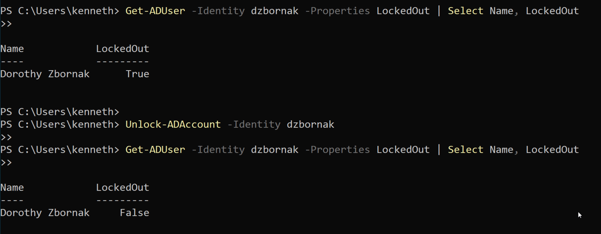

# Active Directory Home Lab

## Objective
Deploy and configure an Active Directory environment in Microsoft Azure to
simulate real-world enterprise identity management. Perform common help desk
and sysadmin tasks using both the GUI and PowerShell, demonstrating hands-on
proficiency with the tools and workflows used daily in IT support roles.

## Tools & Technologies Used
- Microsoft Azure (VM hosting and VNet configuration)
- Windows Server (Domain Controller)
- Windows 11 Pro (Domain Client)
- Active Directory Domain Services (AD DS)
- PowerShell
- Remote Desktop Protocol (RDP)

## Real-World Relevance
Active Directory is the backbone of identity management in the vast majority
of enterprise environments. Tier 1 help desk technicians interact with AD
daily — resetting passwords, unlocking accounts, managing group memberships,
and onboarding and offboarding users. This lab demonstrates hands-on
proficiency with these core responsibilities in a simulated enterprise
environment.

## Repository Structure
```
active-directory-lab/
├── README.md
├── 01-environment-setup/
├── 02-ou-groups-users/
├── 03-account-management/
├── 04-service-accounts/
└── 05-onboarding-offboarding/
```

---

## Part 1 — Environment Setup

Deployed two virtual machines in Microsoft Azure on the same Virtual Network
(VNet) to simulate an enterprise domain environment:

- **WinServer** — Windows Server configured as the Active Directory Domain
  Controller for the domain `lab.local`
- **Win11Pro** — Windows 11 Pro client joined to the `lab.local` domain

### DNS Configuration

A critical step in joining a client to a domain is pointing the client's DNS
to the domain controller's private IP address. Without this the client cannot
locate the domain and the join will fail.

The domain controller's DNS was verified to confirm it was resolving correctly,
and the client's network adapter DNS was manually set to the domain controller's
private IP address via adapter settings and confirmed via ipconfig.


### Client Joined to Domain

After configuring DNS, the Windows 11 Pro client was joined to the `lab.local`
domain. The join was verified in two ways — the client computer appeared in
Active Directory Users and Computers under the Computers container, and a
successful domain login was performed on the client machine.


---

## Part 2 — OU, Groups, and User Management

Created an Organizational Unit (OU) structure to mirror a real enterprise
directory. Managed group memberships and moved user objects between OUs
to simulate department transfers and reorganization.

**Created OUs:**
- Employees
- IT Department
- Service Accounts
- Disabled Users

**GUI Method — Create OU:**
ADUC → right click domain → New → Organizational Unit → name it

**PowerShell Method — Create OU:**
```powershell
New-ADOrganizationalUnit -Name "IT Department" -Path "DC=lab,DC=local"
```

**Add User to Group:**

GUI: ADUC → find user → right click → Add to a group → type group name → OK

PowerShell:
```powershell
Add-ADGroupMember -Identity "IT Support" -Members "jsmith"
```

Verified group membership:
```powershell
Get-ADGroupMember -Identity "IT Support" | Select Name
```

**Move Object to Different OU:**

GUI: ADUC → find user → right click → Move → select destination OU → OK

PowerShell:
```powershell
Move-ADObject `
  -Identity "CN=John Smith,OU=Employees,DC=lab,DC=local" `
  -TargetPath "OU=IT Department,DC=lab,DC=local"
```


---

## Part 3 — Account Management

Performed the two most common Tier 1 Active Directory help desk tasks —
password resets and account unlocks — using both the GUI and PowerShell.

### Password Reset

**GUI Method:**
ADUC → find user → right click → Reset Password → set temporary password →
check "User must change password at next logon"

**PowerShell Method:**
```powershell
Set-ADAccountPassword -Identity "jsmith" `
  -NewPassword (ConvertTo-SecureString "NewTemp456!" -AsPlainText -Force) `
  -Reset

Set-ADUser -Identity "jsmith" -ChangePasswordAtLogon $true
```


---

### Account Unlock

**GUI Method:**
ADUC → find user → right click → Properties → Account tab →
check "Unlock account"

**PowerShell Method:**
```powershell
Unlock-ADAccount -Identity "jsmith"
```

Verified the account was unlocked:
```powershell
Get-ADUser -Identity "jsmith" -Properties LockedOut | Select Name, LockedOut
```




---

## Part 4 — Service Accounts

Created a dedicated service account used to run applications or services
under a controlled identity rather than a regular user account — a common
security best practice in enterprise environments.

**GUI Method:**
ADUC → right click Service Accounts OU → New → User → name with svc- prefix →
set password → uncheck "User must change password" → check "Password never expires"

**PowerShell Method:**
```powershell
New-ADUser `
  -Name "svc-Helpdesk" `
  -SamAccountName "svc-Helpdesk" `
  -UserPrincipalName "svc-Helpdesk@lab.local" `
  -Path "OU=Service Accounts,DC=lab,DC=local" `
  -AccountPassword (ConvertTo-SecureString "ServicePass123!" -AsPlainText -Force) `
  -PasswordNeverExpires $true `
  -CannotChangePassword $true `
  -Enabled $true
```


---

## Part 5 — Onboarding and Offboarding

Simulated the full employee lifecycle — creating a new user account during
onboarding and securely disabling and archiving the account during offboarding
following security best practices.

### Onboarding — Create New User

**GUI Method:**
ADUC → right click OU → New → User → fill in name, username, password →
check "User must change password at next logon"

**PowerShell Method:**
```powershell
New-ADUser `
  -Name "John Smith" `
  -GivenName "John" `
  -Surname "Smith" `
  -SamAccountName "jsmith" `
  -UserPrincipalName "jsmith@lab.local" `
  -Path "OU=Employees,DC=lab,DC=local" `
  -AccountPassword (ConvertTo-SecureString "TempPass123!" -AsPlainText -Force) `
  -ChangePasswordAtLogon $true `
  -Enabled $true
```


---

### Offboarding — Disable and Archive User

Rather than immediately deleting the account, the user was disabled and moved
to a Disabled Users OU — the standard secure offboarding practice in enterprise
environments that preserves the account for auditing purposes.

**GUI Method:**
ADUC → find user → right click → Disable Account → right click → Move →
select Disabled Users OU

**PowerShell Method:**
```powershell
# Disable the account
Disable-ADAccount -Identity "jsmith"

# Remove from all groups except Domain Users
Get-ADUser -Identity "jsmith" -Properties MemberOf |
  Select-Object -ExpandProperty MemberOf |
  ForEach-Object { Remove-ADGroupMember -Identity $_ -Members "jsmith" -Confirm:$false }

# Move to Disabled Users OU
Move-ADObject `
  -Identity "CN=John Smith,OU=Employees,DC=lab,DC=local" `
  -TargetPath "OU=Disabled Users,DC=lab,DC=local"
```


---

## Key Concepts Demonstrated

| Task                | GUI | PowerShell | Real-World Use Case                        |
|---------------------|-----|------------|--------------------------------------------|
| User Onboarding     | ✅  | ✅         | New employee account provisioning          |
| Password Reset      | ✅  | ✅         | Most common Tier 1 help desk ticket        |
| Account Unlock      | ✅  | ✅         | Lockout after failed login attempts        |
| Group Management    | ✅  | ✅         | Granting and revoking resource access      |
| OU Management       | ✅  | ✅         | Department transfers, reorganization       |
| Service Account     | ✅  | ✅         | Running services under controlled identity |
| User Offboarding    | ✅  | ✅         | Secure departure process                   |

---

## Notes
This lab was built using Microsoft Azure with both VMs on the same VNet to
simulate enterprise domain connectivity. The osTicket ticketing lab references
this environment directly — password reset and account unlock tickets in
osTicket were resolved by performing the corresponding tasks in this Active
Directory lab, demonstrating how a real Tier 1 help desk environment operates.
